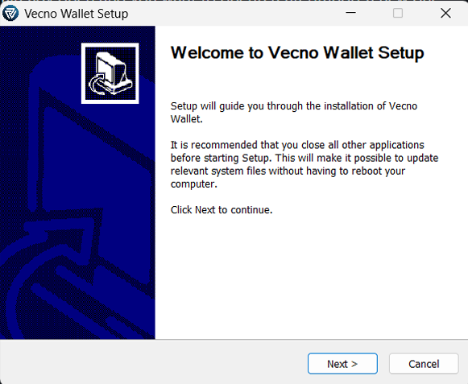
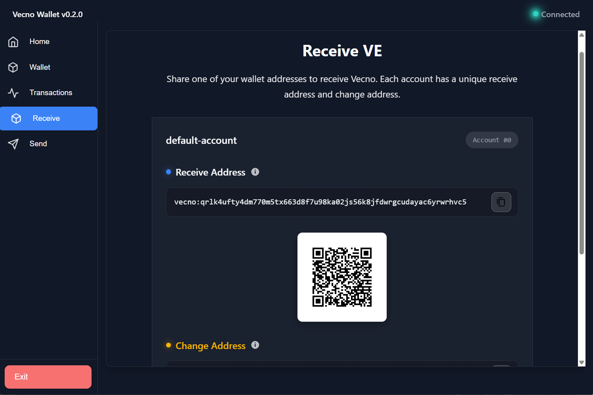
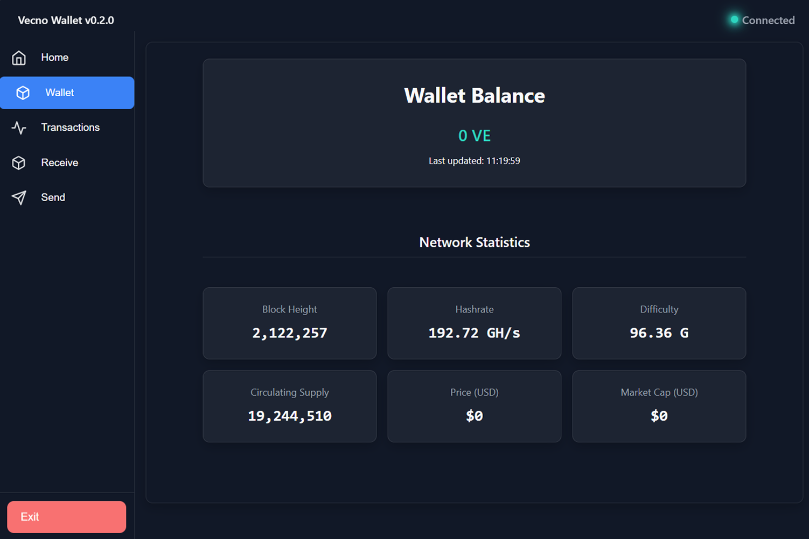
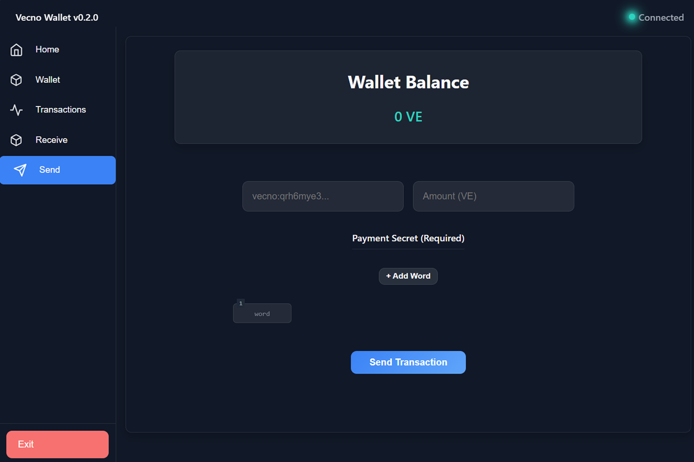
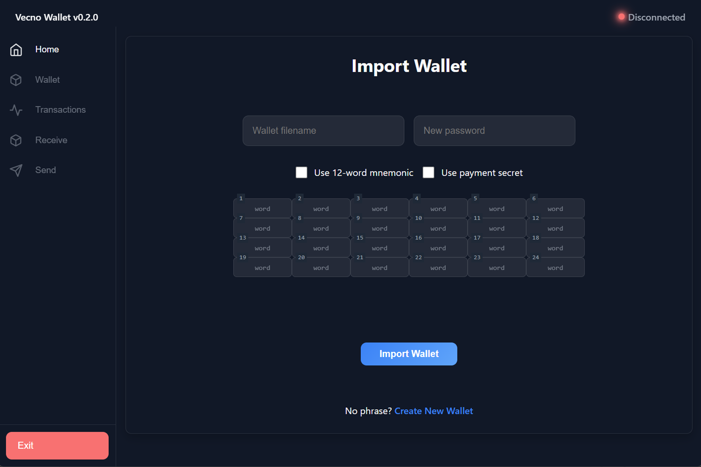

# Vecno Desktop Wallet
**Full-featured, secure GUI wallet for Windows**

The **Vecno Desktop Wallet** is the official graphical interface for managing your Vecno funds.  
It provides a user-friendly way to:

- View your balance and transaction history
- Receive and send Vecno (VE)
- Generate and manage addresses
- Back up and restore your wallet securely
- Track your holdings over time

### Key Security Features
- Your private keys never leave your device
- **Payment Secret** - an additional passphrase you set during wallet creation/import.  
  This **must be entered every time** you want to **send/transfer VE** - it adds strong extra protection against unauthorized transfers, even if someone gains access to your computer.

### Why use the Desktop Wallet?
- Full control with everyday convenience
- Easier balance tracking and sending/receiving than paper wallets
- Ideal for mining payouts, daily use, and medium/long-term holding
- **Payment Secret** provides transaction-level security beyond just the seed phrase

### Step-by-Step: How to Get Started

1. **Download & Install**
   - Go to the official repository: https://github.com/Vecno-Foundation/vecno-desktop-wallet
   - In the **Releases** section (once available), download the latest version for your OS
   - Run the installer and follow the on-screen instructions

   **Example of a typical desktop wallet installer/setup screen:**

   

2. **Create or Import a Wallet**
   - Launch the application
   - Choose **Create New Wallet** (recommended for new users) or **Import Wallet**
   - For **Create New Wallet**:  
     The wallet generates a **24-word BIP-39 seed phrase** (your master recovery key). Write it down by hand - never screenshot or store digitally!
   - For **Import Wallet**:  
     Select this option to recover an existing wallet using your 24-word seed phrase.

   **Set your Payment Secret**:
   - During creation or import, you will be prompted to create (or confirm) a strong **Payment Secret** (a passphrase or PIN)
   - This is for extra security
   - Remember it or store it separately from your seed phrase (e.g., different safe location)

   **Critical: Back up your seed phrase & Payment Secret securely**

   **Never**:
   - Take photos/screenshots of seed phrase or Payment Secret
   - Save digitally (cloud/email/notes)
   - Share with anyone

3. **Secure Your Wallet**
   - Store your **seed phrase** and **Payment Secret** in **multiple safe physical locations** (safe, bank deposit box, fireproof safe, etc.)
   - Test your backup: Use the import option with a small test wallet to verify everything works

   **Recommended: Handwritten backup of your 24-word seed phrase (and separately note your Payment Secret)**

4. **Receive Vecno**
   - Go to the **Receive** tab
   - Copy your **Vecno address** (starts with `vecno:`) or scan the QR code
   - Share it with senders (mining pools, exchanges, friends)

   **Example of a typical receive screen with address and QR code:**

   

5. **View Balance & Transactions**
   - The main dashboard shows:
     - Your total balance
     - Network status
     - Network Statistics
   - The wallet syncs automatically with the Vecno blockchain.

   **Example of the main dashboard overview:**

   

6. **Send Vecno (VE) – Requires Payment Secret**
   - Go to the **Send** tab
   - Enter the recipient address
   - Specify amount
   - **Enter your Payment Secret** to authorize the transfer (required every time you send)
   - Confirm and broadcast

   **Example of the send screen (note the password field for Payment Secret):**

   

7. **Import Wallet from Backup (Recovery)**
   - Choose **Import Wallet** on launch
   - Enter your 24-word seed phrase carefully
   - **Re-enter/set your Payment Secret** (must match what you used originally for sends to work)
   - Your funds and history will reappear after the wallet syncs with the network

   **Example of the Import Wallet screen where you enter your seed phrase:**

   

**With the Payment Secret, your Vecno stays extra secure - even on a compromised device!**