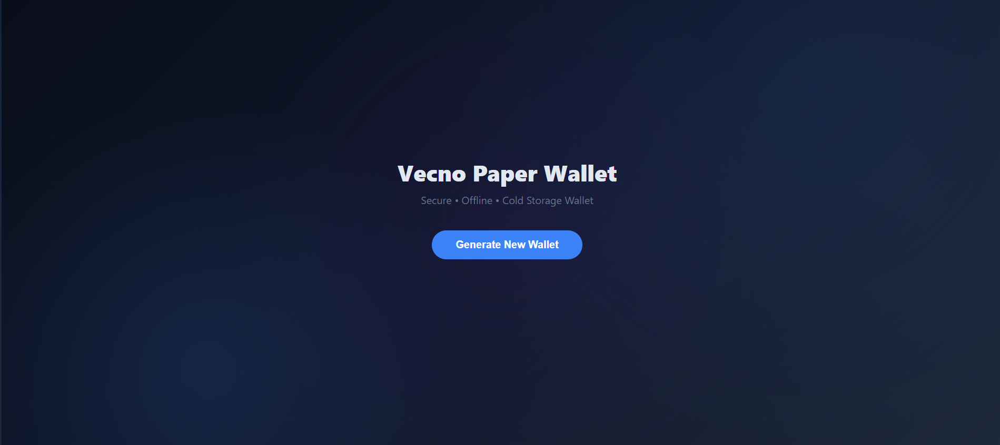
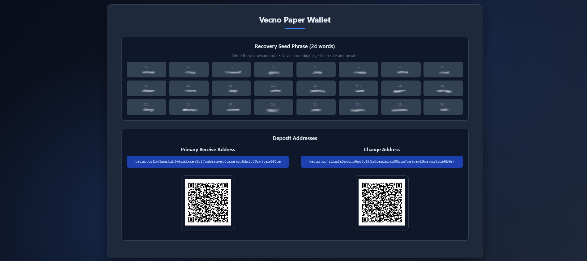

# Vecno Paper Wallet  
**Simple, secure offline cold storage for your Vecno**

The Vecno Paper Wallet lets you create a completely offline wallet in your browser.  
All sensitive data (seed phrase + keys) is generated and stays only on your device - nothing is sent to any server.

### Why choose a paper wallet?
- Maximum security for long-term storage
- Perfect for mining payouts you don't plan to spend soon
- No software installation needed

### Step-by-Step Guide – Create & Secure Your Vecno Paper Wallet

1. **Prepare a safe environment** (very important!)
   - Best: Use an offline/air-gapped computer or a clean live-USB system
   - Good: Trusted computer → load the page → immediately disconnect internet (Wi-Fi off + cable unplugged)
   - Avoid: Public computers, shared networks, or devices with potential malware

2. **Open the generator**
   - Visit: https://paperwallet.vecnoscan.org/
   - Wait until everything fully loads (you'll see the "Generate New Wallet" button)
   - **Disconnect from the internet now** for best security

**This is what the clean interface looks like before you generate the wallet:**

3. **Generate your wallet**
   - Click **Generate New Wallet**
   - In seconds you will see:
     - **24-word BIP-39 seed phrase** (your master recovery key)
     - **Primary receive address** (vecno:...) – main address for receiving
     - **Change address** (used automatically when sending)
     - QR codes for both addresses

**Example of what the generated paper wallet looks like (with seed phrase, addresses and QR codes):**

4. **Back up your seed phrase – this is critical!**
   - **Write the 24 words down by hand** on paper (never type them digitally)
   - Number them 1–24
   - Check twice that you wrote everything correctly
   - Store copies in **multiple safe places** (safe, bank box, fireproof location, trusted family members, etc.)

**Never**:
- Take photos/screenshots
- Save in cloud/email/notes app
- Type into any device connected to the internet

5. **Print the wallet (optional but recommended)**
   - Use your browser print function (Ctrl+P / Cmd+P)
   - Print on good quality paper
   - Store the printout in a secure, protected location

6. **How to receive Vecno**
   - Share your **Primary receive address** (or its QR code)
   - You can safely check balance anytime on https://vecnoscan.org/ (just enter the address – no private info needed)

7. **How to spend / move funds later (when needed)**
   - Import or sweep the **24-word seed phrase** into a trusted wallet software:
     - Recommended: Official Vecno Desktop Wallet → https://github.com/Vecno-Foundation/vecno-desktop-wallet
   - Do **not** enter your seed phrase on any website or untrusted device

If you follow these steps, your Vecno is extremely well protected for long-term holding.
